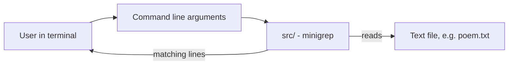

<div align="center">

# 🔍 minigrep

**A small command line search tool in Rust, built while following along with the Rust "brown book".**

<p>
  
  
</p>

</div>

> 📚 A learning project: I wrote this while working through The Rust Programming Language (the "brown book").

## 📑 Table of Contents

- [📖 About](#about)
- [🏗️ Architecture](#architecture)
- [✨ Features](#features)
- [🛠️ Tech Stack](#tech-stack)
- [🚀 Getting Started](#getting-started)
- [👤 Author](#author)

## 📖 About

- minigrep is a simplified version of the classic `grep` tool.
- It searches a text file for lines that contain a given query and prints the matching lines.
- The repository includes `poem.txt`, a sample file you can use to try it out.

## 🏗️ Architecture



## ✨ Features

- Search a file for a query string from the command line.
- Prints every line that contains the query.
- Comes with a sample `poem.txt` to experiment with.

<!-- TODO: verify whether case-insensitive search (e.g. via an IGNORE_CASE environment variable, as in the book) is implemented, and document it here. -->

## 🛠️ Tech Stack

| Area | Technologies |
| --- | --- |
| Language | Rust |
| Build tool | Cargo |
| Learning resource | The Rust Programming Language ("brown book") |

## 🚀 Getting Started

### Prerequisites

- [Rust and Cargo](https://www.rust-lang.org/tools/install)

### Clone

```bash
git clone https://github.com/MriceDK/minigrep.git
cd minigrep
```

### Run

Pass the search query first and the file path second:

```bash
cargo run -- <query> <file_path>
```

For example, using the included sample file:

```bash
cargo run -- nobody poem.txt
```

<!-- TODO: confirm the argument order and the example query against src/main.rs. -->

### Build a release binary

```bash
cargo build --release
```

## 👤 Author

| Name | GitHub | LinkedIn |
| --- | --- | --- |
| Maurice De Kegel | [MriceDK](https://github.com/MriceDK) | [LinkedIn](https://www.linkedin.com/in/dekegelmaurice/) |
